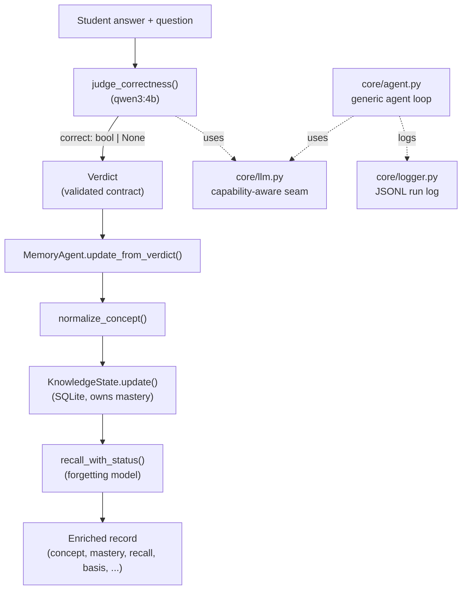
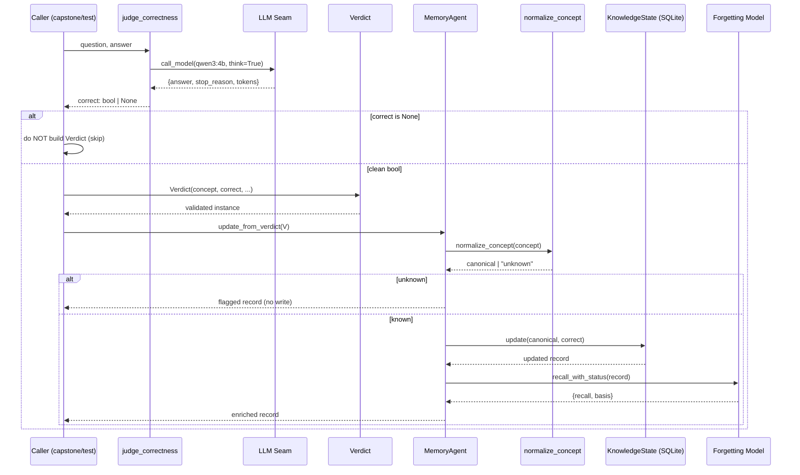
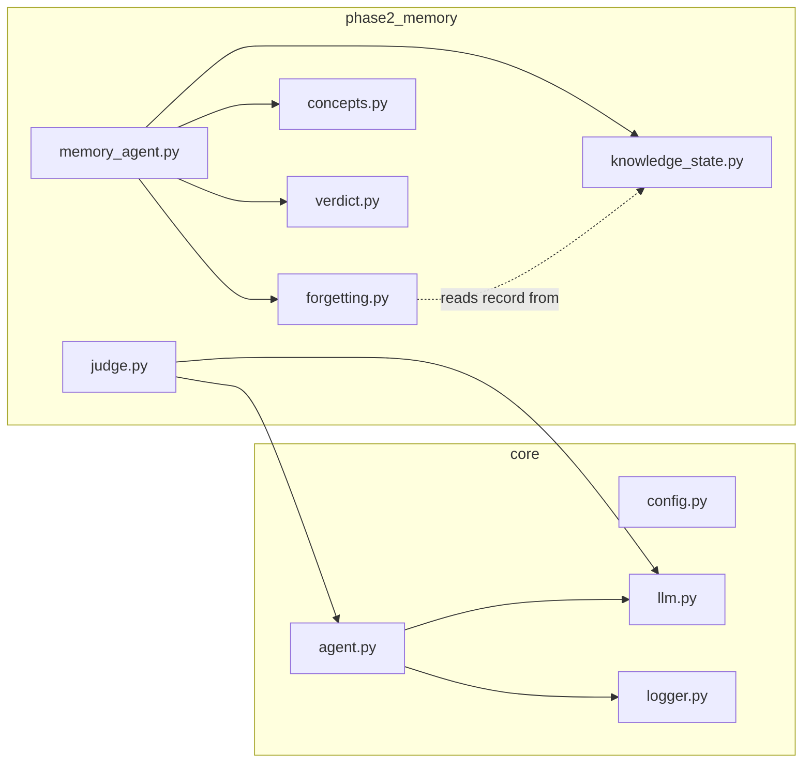
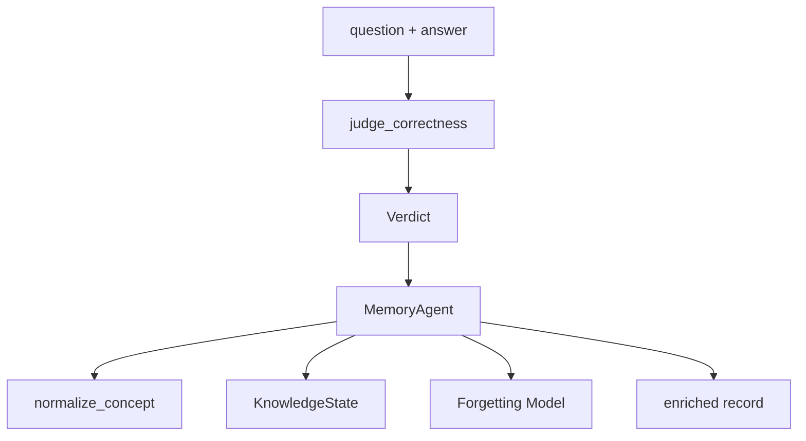
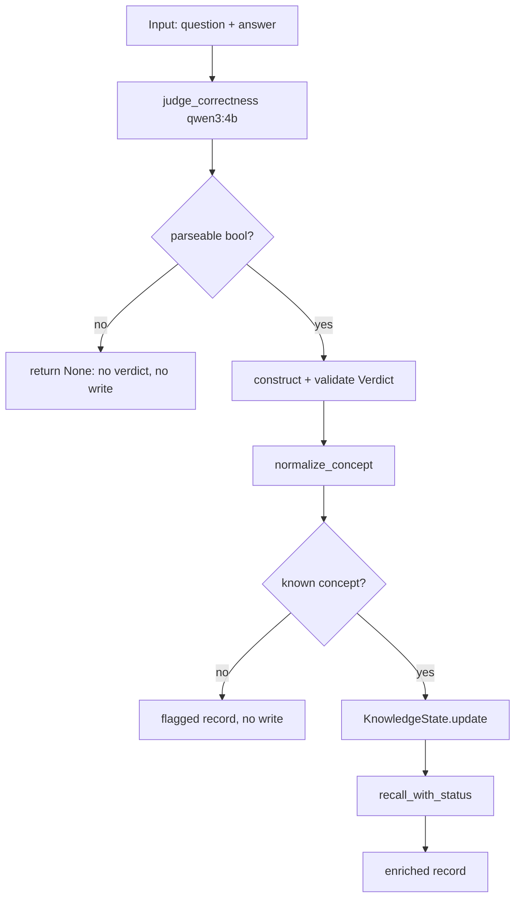

# MiniNoetica — Architecture

> **Status:** Active development. This document describes the system **as actually implemented** through Day 2 of construction, not the full target vision. Components that are planned but not yet built are marked **`[PLANNED — not implemented]`**. If you are reading the code alongside this document and find a discrepancy, the code is the source of truth — please open an issue.

---

## 1. Executive Overview

**MiniNoetica** is the foundational spike of *Noetica*, an AI Learning Intelligence Engine. Its purpose is to model **what a student knows, what they have forgotten, and how their knowledge changes over time** — and ultimately to recommend the next best learning action.

The problem it addresses: a quiz score is a snapshot. It tells you a student answered correctly *once*, but not whether they still remember the concept today, whether their mistake is recurring, or what they should study next. MiniNoetica treats learning as a *stateful, time-decaying process* owned by the system, separate from the language model that judges individual answers.

The currently implemented pipeline, end to end, is:

1. A student answer to a question is judged **correct or incorrect** by a reasoning-capable local language model.
2. That judgment is packaged into a typed, validated **`Verdict`**.
3. A deterministic **Memory Agent** consumes the verdict: it normalizes the concept to a known curriculum entry, updates a persistent **mastery** score, and computes the student's **current recall probability** accounting for forgetting since the last review.
4. The result is an **enriched record** describing the student's updated knowledge state for that concept.

The defining architectural idea: **the language model is a stateless judge; the knowledge about the learner lives in the system, not the model.** Everything downstream of judgment is deterministic, testable, and owned by code.

---

## 2. High-Level System Architecture

MiniNoetica is currently a **library of composable components** exercised by test harnesses and a capstone script — not a network service. There is no HTTP layer, router, or external API surface yet. Execution is driven by direct function/method calls.

The major subsystems:

| Subsystem | Role | LLM? |
|---|---|---|
| **LLM Seam** (`core/llm.py`) | Single chokepoint to the local model; capability-aware | — |
| **Agent Loop** (`core/agent.py`) | Generic iterate-until-done control loop + JSON extraction | calls seam |
| **Run Logger** (`core/logger.py`) | Append-only JSONL record of agent runs | — |
| **Judge** (`phase2_memory/judge.py`) | Produces a correctness boolean (bridge code) | qwen3:4b |
| **Verdict** (`phase2_memory/verdict.py`) | Typed, validated contract carrying a judgment | — |
| **Memory Agent** (`phase2_memory/memory_agent.py`) | Consumes a verdict, orchestrates state update | none (pure) |
| **Concept Normalizer** (`phase2_memory/concepts.py`) | Maps messy concept strings to canonical curriculum | — |
| **KnowledgeState** (`phase2_memory/knowledge_state.py`) | Persistent per-concept mastery store (SQLite) | — |
| **Forgetting Model** (`phase2_memory/forgetting.py`) | Time-decayed recall probability | — |

Communication is by **direct calls and typed data objects**, not message passing. The one typed contract that crosses a meaningful boundary is the `Verdict` (judgment → memory).



**Note on the Agent Loop:** `core/agent.py`'s `run_agent` is a *general-purpose* iterate-until-done loop built and validated on Day 1. The Memory pipeline does **not** currently route through it — the Memory Agent is a deterministic coordinator, not an LLM loop. `run_agent` exists as proven infrastructure for future LLM-driven agents (e.g. the planned Reasoning Agent).

---

## 3. Repository Structure

```
noetica-agent-lab/
├── core/
│   ├── config.py            # env/config loading
│   ├── llm.py               # the LLM seam (single model chokepoint)
│   ├── agent.py             # generic agent loop + _extract_json
│   └── logger.py            # append-only JSONL run logger
├── phase2_memory/
│   ├── knowledge_state.py   # persistent mastery store (SQLite)
│   ├── forgetting.py        # recall decay (pure functions)
│   ├── concepts.py          # curriculum + concept normalization
│   ├── verdict.py           # Verdict typed contract
│   ├── memory_agent.py      # verdict-consuming coordinator (+ legacy extraction)
│   ├── judge.py             # correctness judge (bridge code)
│   └── capstone.py          # end-to-end demonstration script
├── agent_zero/              # Day-1 step scripts (seam/loop bring-up)
├── tests/                   # pytest suites (unit + integration + live)
├── data/                    # SQLite DB + agent_runs.jsonl (gitignored)
└── pytest.ini               # registers the `live` marker
```

**`core/`** holds subsystem-agnostic infrastructure. It is the foundation every higher layer calls and must never depend on `phase2_memory/`. The dependency direction is strictly `phase2_memory → core`, never the reverse.

**`phase2_memory/`** holds the learner-memory subsystem — the Phase 2 deliverable. Each module has exactly one responsibility (see §5). The package name reflects that this is one phase of a larger planned system.

**`agent_zero/`** holds the incremental Day-1 bring-up scripts (`step1_seam.py` … `step7_eval.py`, plus probes). These are *historical/diagnostic* harnesses, not production modules. They prove the seam and loop behave correctly and double as runnable documentation of how those components were validated.

**`tests/`** holds the pytest suites. Test files mirror modules (`test_forgetting.py` ↔ `forgetting.py`). Live tests (real model) are marked and deselectable.

**`data/`** holds runtime artifacts: the SQLite database and the JSONL run log. Gitignored.

---

## 4. Request Lifecycle

There is **no network request** in the current system — the "request" is a function call carrying a question and a student answer. The lifecycle, as implemented:

1. **Input.** A `(question, student_answer)` pair, plus (in the full path) the canonical concept the answer concerns.
2. **Routing.** `[PARTIAL]` There is no dynamic router. Control flow is explicit code. Model *selection* is the closest thing to routing: each LLM call names its model (`qwen3:4b` for judgment, `qwen2.5:3b` for cheap extraction), and the seam's capability guard adjusts behavior per model.
3. **LLM interaction.** `judge_correctness()` calls the seam with the reasoning model and a minimal correctness prompt.
4. **Structured output + validation.** The raw model text is sanitized (reasoning markup stripped) and parsed via `_extract_json`. The judge accepts a result **only if** `correct` is a genuine boolean; anything else → `None`.
5. **Judgement → Verdict.** On a clean boolean, the caller constructs a `Verdict`, which **validates at construction** (non-empty concept, real bool, consistent mistake fields, confidence in range). On `None`, the caller must **not** construct a verdict.
6. **Persistence.** `MemoryAgent.update_from_verdict()` normalizes the concept; if it maps to a known curriculum entry, `KnowledgeState.update()` writes the new mastery, increments counters, and stamps `last_reviewed_at` in SQLite.
7. **Storage / recall.** The forgetting model computes current recall from the updated record.
8. **Final response.** An **enriched record** (dict) is returned to the caller: `concept, correct, mastery, recall, basis, misconception, confidence, source, flagged, flag_reason`.
9. **Error handling.** Each stage fails *safely* — see §9. The dominant pattern: a failure becomes **flagged data**, not an exception, so the pipeline never corrupts state.

---

## 5. Core Components

### `core/llm.py` — The LLM Seam
- **Purpose:** the single point through which all model calls pass.
- **Responsibilities:** build the message list, apply a **capability guard** (`think=True` is silently disabled for models not in `THINKING_MODELS`), invoke Ollama, and return a normalized dict. Sanitizes leaked reasoning markup from the answer channel via `_clean_answer`.
- **Public interface:** `call_model(messages, system="", max_tokens=2048, think=True, model=MODEL) -> dict` with keys `answer, thinking, stop_reason, input_tokens, output_tokens`.
- **Dependencies:** `ollama`.
- **Failure cases:** a model that rejects `think=True` would 400 — prevented by the capability guard. Truncation surfaces as `stop_reason == "length"`.

### `core/agent.py` — Generic Agent Loop
- **Purpose:** an iterate-until-done control loop for LLM-driven agents; also hosts `_extract_json`, the shared JSON extractor.
- **Responsibilities:** call the seam, parse a structured `status` (final/continue), enforce a `max_steps` budget, attempt one repair on parse failure, and emit a per-run record to the logger.
- **Public interface:** `run_agent(goal, max_steps=5, check_fn=None) -> dict`; `_extract_json(text) -> str`.
- **Dependencies:** `core/llm.py`, `core/logger.py`.
- **Failure cases:** parse failure → repair retry then graceful give-up; truncation → halt; budget exhaustion → `terminated_reason="max_steps"`.
- **Note:** not currently on the Memory path; reserved for future LLM agents.

### `phase2_memory/judge.py` — Correctness Judge `[BRIDGE]`
- **Purpose:** produce the `correct` boolean a `Verdict` requires.
- **Responsibilities:** call qwen3:4b with a minimal correctness prompt, parse strictly to bool.
- **Public interface:** `judge_correctness(question, student_answer) -> bool | None`.
- **Dependencies:** `core/llm.py`, `core/agent._extract_json`.
- **Outputs:** `True`/`False`, or `None` on any parse/type failure (caller must not build a verdict).
- **Failure cases:** unparseable output, missing `correct` field, non-bool `correct` → all return `None`.
- **Status:** explicitly temporary; superseded by the planned Reasoning Agent.

### `phase2_memory/verdict.py` — Verdict Contract
- **Purpose:** the typed, validated message carrying a judgment into Memory.
- **Responsibilities:** validate at construction — non-empty `concept`, genuine `bool` `correct`, `confidence ∈ [0,1]`, and internal consistency (a correct verdict may not carry `mistake_type`/`misconception`).
- **Public interface:** `Verdict(concept, correct, mistake_type="", misconception="", confidence=1.0, source="manual")`.
- **Failure cases:** any violation raises `ValueError` at construction — invalid verdicts cannot exist.

### `phase2_memory/memory_agent.py` — Memory Agent
- **Purpose:** consume a `Verdict` and produce an enriched knowledge-state record.
- **Responsibilities:** **sequencing only** — normalize concept → guard unknown → `store.update` → `recall_with_status` → assemble record. Owns no mastery math and no decay math.
- **Public interface:** `MemoryAgent(store).update_from_verdict(verdict) -> dict`.
- **Dependencies:** `concepts`, `knowledge_state`, `forgetting`, `verdict`.
- **Failure cases:** concept normalizing to `unknown` → flagged record, **no store write**.
- **Legacy:** still contains `analyze()` and extraction helpers (`extract_answer_analysis`) — superseded for judgment, retained pending the Knowledge Agent. `analyze()` has no live caller; its tests are quarantined.

### `phase2_memory/concepts.py` — Concept Normalizer
- **Purpose:** map an arbitrary concept string to one canonical curriculum entry, or `"unknown"`.
- **Responsibilities:** clean → exact match → prefix-aware word-overlap match with a tie-breaker that returns `"unknown"` on ambiguity.
- **Public interface:** `normalize_concept(raw) -> str`; `KNOWN_CONCEPTS`, `UNKNOWN`.
- **Failure cases:** empty/unrelated/ambiguous input → `UNKNOWN` (fails safe; never a wrong confident match).

### `phase2_memory/knowledge_state.py` — KnowledgeState
- **Purpose:** the persistent source of truth about a learner's mastery, one row per concept.
- **Responsibilities:** owns the **mastery update rule** (asymptotic growth on correct, proportional decay on incorrect), counters, and `last_reviewed_at`.
- **Public interface:** `get`, `get_or_init`, `get_all`, `update(concept, correct) -> dict`, `reset`, `close`.
- **Dependencies:** `sqlite3` (stdlib).
- **Failure cases:** parameterized queries (no injection); `:memory:` mode for tests.

### `phase2_memory/forgetting.py` — Forgetting Model
- **Purpose:** compute **current recall probability** from mastery and elapsed time.
- **Responsibilities:** Ebbinghaus exponential decay; half-life scales with mastery; recall is **computed, never stored**.
- **Public interface:** `recall_probability`, `half_life_days`, `recall_for_record`, `recall_with_status(record) -> {recall, basis}`.
- **Failure cases:** never-reviewed record → returns mastery (`basis="never_reviewed"`); negative elapsed clamps to 1.0; naive datetime coerced to UTC; mastery 0 floored to avoid div-by-zero.

---

## 6. AI Pipeline

The AI footprint is deliberately **small and isolated** — exactly one LLM call type is on the live state path.

- **Prompt generation.** Static system prompts per task. The judge uses a minimal correctness prompt proven not to truncate qwen3:4b at `max_tokens=1024`.
- **Model invocation.** Always through `core/llm.py`. Model is selected per task: **qwen3:4b** (reasoning-capable) for correctness judgment; **qwen2.5:3b** (fast) for cheap extraction in the legacy/Knowledge path.
- **Structured output.** Models return JSON in the answer channel. `_clean_answer` strips reasoning markup; `_extract_json` recovers JSON from prose/fences.
- **Validation.** The judge accepts only a genuine boolean. The `Verdict` re-validates at the contract boundary. Two independent gates guard the same corruption class.
- **Fallback logic.** Judge returns `None` on any failure → caller skips verdict construction → state is never touched on an uncertain judgment.
- **Decision making.** Correctness only, today. Mistake classification and next-action planning are `[PLANNED]`.
- **Error recovery.** The generic agent loop has a one-shot repair retry on malformed JSON; the judge has no retry (a single clean attempt or `None`).

**Empirically established constraints** (from Day-1/Day-2 measurement):
- qwen2.5:3b **cannot** reliably judge fraction correctness; qwen3:4b judges 6/6 on the validated set.
- qwen3:4b correctness judgment costs **~20–53 s** per call on CPU inference — acceptable for batch, not interactive.

---

## 7. Data Flow



**Object lifecycles & ownership:**
- A **`Verdict`** is immutable-by-convention input; it lives only for the duration of one update call.
- A **KnowledgeState row** is durable; it persists across sessions and is the single owner of mastery.
- **Recall** is ephemeral — recomputed on every read, never stored. Mastery (durable) and recall (computed) are strictly separated.

---

## 8. State Management

| State | Lives in | Persisted? | Mutable? |
|---|---|---|---|
| Mastery, counters, `last_reviewed_at` | `KnowledgeState` (SQLite) | Yes | Yes (only via `update`) |
| Recall probability | computed on demand | No | n/a (derived) |
| `Verdict` | in-memory, per call | No | No (validated, treated immutable) |
| Curriculum (`KNOWN_CONCEPTS`) | `concepts.py` constant | Code | No (immutable) |
| Agent run records | `data/agent_runs.jsonl` | Yes (append-only) | No (immutable log) |
| Learning/forgetting constants | module constants | Code | No (**placeholders**, see §13) |

The central rule: **mastery is the only durable learner state, and it changes only through `KnowledgeState.update`.** Nothing else writes mastery. Recall is always derived, never authoritative.

---

## 9. Error Handling Strategy

The system's guiding principle is **fail into data, not into exceptions** — a failure should produce a flagged/None result that the pipeline can route, not crash mid-update.

| Error path | Handling |
|---|---|
| LLM rejects `think=True` | Prevented upstream by the capability guard |
| Output truncated | Surfaced as `stop_reason="length"`; agent loop halts |
| Leaked reasoning markup in answer | Stripped by `_clean_answer` at the seam |
| Invalid/malformed JSON | `_extract_json` raises → judge returns `None`; agent loop repairs once |
| Missing/`non-bool` `correct` | Judge returns `None` → no verdict built |
| Invalid verdict fields | `Verdict.__post_init__` raises `ValueError` at construction |
| Off-curriculum concept | `normalize_concept` → `"unknown"` → Memory flags, **no store write** |
| Storage | Parameterized SQL; no injection path; commits per write |
| Timeouts | `[NOT IMPLEMENTED]` — no timeout layer exists; long model calls block |

The two **store-corruption guards** are the most important error paths: a `None`/non-bool judgment never reaches the store (it never becomes a verdict), and an unknown concept never writes a row. Both are covered by tests.

---

## 10. Design Principles

- **Separation of concerns.** Judgment (LLM), concept identity (normalizer), mastery (store), recall (forgetting), and sequencing (Memory Agent) are five distinct modules. No module does two of these.
- **Single responsibility.** The Memory Agent owns *only* sequencing; it computes neither mastery nor recall.
- **Deterministic processing.** Everything after judgment is pure/deterministic. The only nondeterminism is the single LLM judgment call, isolated behind one function.
- **Testability.** Pure functions and an in-memory SQLite mode make the entire state machine testable without a model. The LLM is mockable at the seam.
- **Extensibility.** New agents plug in by producing a `Verdict` or consuming an enriched record; the contract is the extension point.
- **Maintainability.** The seam is the single place model behavior is absorbed; capability quirks (thinking, markup leakage) are handled once.

---

## 11. Testing Architecture

Three categories, mirrored to modules:

- **Unit tests** (pure, deterministic, no model): `test_forgetting.py`, `test_knowledge_state.py`, `test_concepts.py`, `test_verdict.py`. They assert *math and contracts* — e.g. recall is 0.5 at the half-life, a non-bool `correct` raises.
- **Integration tests** (real store + real normalizer + real forgetting, mocked/typed input): `test_memory_agent_verdict.py`. They assert the *wiring* and guards — notably that a non-canonical concept resolves to a single store row (the split-key bug, proven dead end-to-end).
- **Live tests** (real model, marked `@pytest.mark.live`, deselectable): `test_memory_agent.py::test_live_extraction…`, and the judge's 6-case fraction check. They verify real model output satisfies the contracts.

Confidence is built bottom-up: prove pure math → prove contracts → prove wiring with deterministic inputs → confirm against the real model last. Current status: **58 passed, 5 skipped** (the quarantined legacy `analyze` tests).

---

## 12. Future Extension Points

| To add… | Do this | Without touching… |
|---|---|---|
| **A new agent** (Reasoning, Knowledge, Planner) | Produce a `Verdict` (or consume an enriched record) | Memory Agent internals |
| **A new LLM provider** | Extend `core/llm.py` only; keep the return-dict contract | All callers |
| **A new model** | Add to `THINKING_MODELS` if it reasons; pass `model=` | The seam's callers |
| **New prompts** | Add a system-prompt constant in the relevant module | The seam |
| **New storage backend** | Implement the `KnowledgeState` method surface | Memory Agent (depends on the interface) |
| **New evaluation logic** | Add an external `check_fn`/verifier | The agent loop |

The architectural promise: **agents communicate through typed contracts (`Verdict`, enriched record), so a new agent is an additive change, not a modification.**

---

## 13. Trade-offs

- **Local CPU inference.** No GPU available (`100% CPU`, ~9 tok/s measured). Chosen for zero-cost local development; the cost is latency (~20–53 s for a reasoning judgment). The seam makes swapping to a faster backend a one-line change.
- **Two-model strategy.** qwen3:4b judges (correct but slow); qwen2.5:3b handles cheap tasks (fast). Evidence-driven: qwen2.5:3b provably fails correctness judgment.
- **Judgment outside Memory (Option D).** Memory consumes a verdict rather than producing one. This matches the planned multi-agent separation and keeps Memory pure — at the cost of a temporary `judge.py` bridge until the Reasoning Agent exists.
- **Curriculum-based normalization, not embeddings.** Right weight for a fixed ~10-concept list; avoids pulling in RAG machinery prematurely.
- **Single exponential forgetting curve.** Interpretable and simple; a known simplification of real human forgetting.
- **Limitations that remain:** learning/forgetting **constants are unvalidated placeholders**; single-student, single-process SQLite (no concurrency story); no service layer, router, or timeout handling; `misconception` is free text pending a fixed taxonomy.

---

## 14. Mermaid Diagrams

### Module Dependency Graph


### Component Graph (live state path)


### Request Lifecycle


(System Architecture and Sequence diagrams appear in §2 and §7.)

---

## 15. Glossary

- **Seam** — the single function (`call_model`) all model calls pass through; absorbs provider/model quirks.
- **Capability guard** — logic that disables `think=True` for models that don't support a reasoning channel, preventing a hard error.
- **Verdict** — the typed, self-validating contract carrying a correctness judgment from the judge into Memory.
- **Mastery** — durable, stored measure of how well a concept was *learned*; changes only via `KnowledgeState.update`.
- **Recall** — ephemeral, computed probability the concept is *remembered now*; derived from mastery and elapsed time, never stored.
- **Half-life** — days until recall decays to 0.5; scales with mastery.
- **Basis** — annotation on a recall value indicating whether it was `decayed` from a review or returned raw because the concept was `never_reviewed`.
- **Flagged record** — a result the pipeline produced but deliberately did **not** persist (unknown concept, etc.).
- **Bridge code** — temporary scaffolding (`judge.py`) that will be replaced by a planned component (the Reasoning Agent).
- **`[PLANNED]`** — described in the roadmap, **not yet implemented** in the codebase.

---

## Appendix: What Is NOT Yet Built

To keep this document honest, the following are part of Noetica's vision but **do not exist in code** as of this writing:

- **Reasoning Agent** (will own correctness + mistake classification; replaces `judge.py`)
- **Knowledge Agent** + **RAG** (concept identification via retrieval)
- **Planner Agent** + explicit decision policy (next learning action)
- **Orchestrator** (multi-agent message routing)
- **Service/API layer**, request router, timeout handling
- **Validated** learning-science constants (current values are placeholders)
- **Knowledge graph** across concepts

These are the next milestones, not current capabilities.
